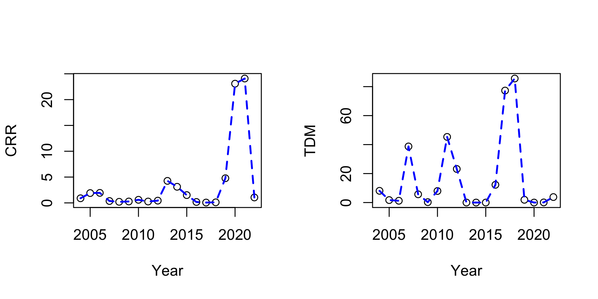
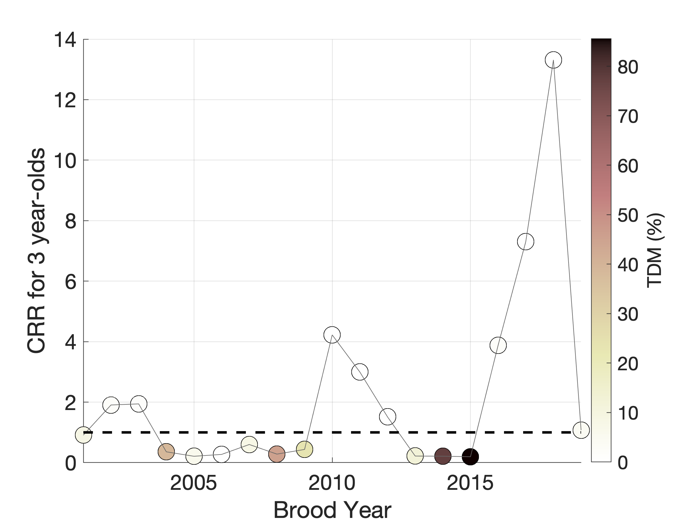
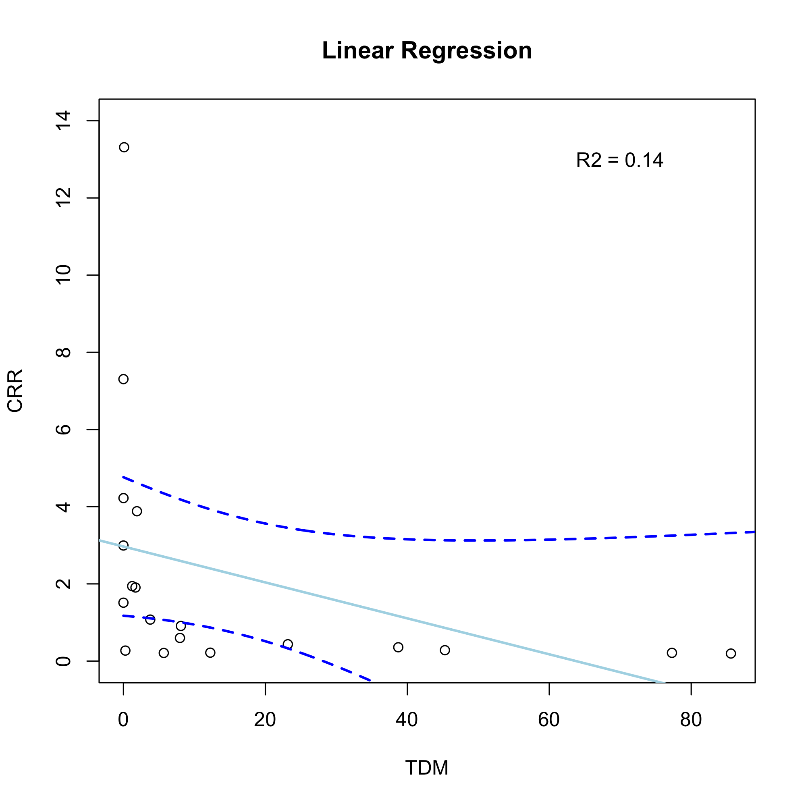
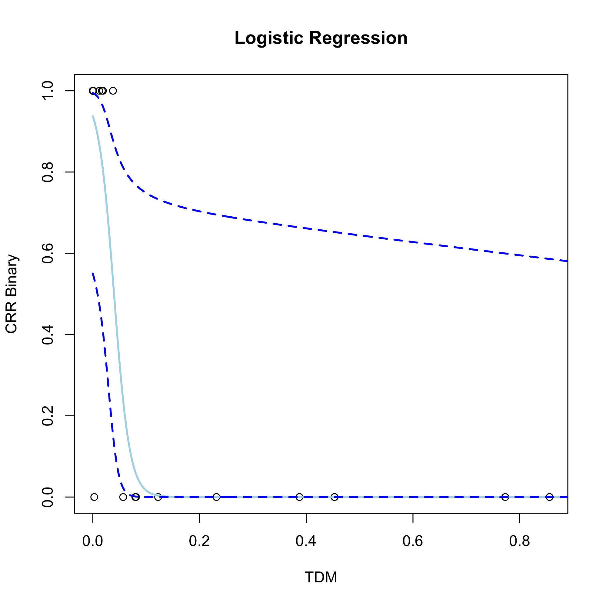

# Cohort Replacement and TDM 
Last updated 4/18/2024, Miles Daniels (miedanie@ucsc.edu)

**Script to explore relationship between Cohort Replacement Rate and TDM for Winter-Run

_Simulations last ran with R version 4.3.2 (2023-10-31) -- "Eye Holes"_

_Note 1: recent data provided by USFWS allows for adjustment of hatchery retunrs and age of returning fish goes from 2001 to 2022._

_Note 2: models have only undergone preliminary diagnostics to look for clear miss-specificaiton._

To start we can plot raw data. We have TDM and CRR from 2001-2022. Assume that the average age of returning adults is 3 years.
The eqaution to calculate the  CRR is:  $$\frac{E_i}{E_{i-3}}$$

Where _E_ is the total estimated run for year _i_.

We can also adjust for hatchery influence and use age data to better constrain for the actual number of the populaiton that experiecned TDM for a given year. 

The eqaution to calculate the adjusted CRR is:  $$\frac{(E_i-(H_i))\times{N3_i}}{(E_{i-3}-(H_{i-3}\))\times{N3_{i-3}}}$$

Where _E_ is the total estimated run for year _i_, _H_ is the hatchery estimated run, _H3_ is the percent of age 3 hatchery origin, and _N3_ is the percent of age 3 or more natural origin fish. Note that while all hatchery fish are aged to year, natural are only classified as 2 year or 3 and older.

## Below are time series for CCR and TDM. These are values that are adjusted for hatchery and age.

Another way to look at this data, however, is shown below where the time series of CRR is plotted, but each year is color coded by TDM. Looking at the data this way seems to show that the year with a significant amount of TDM often have a CRR of < 1. 

## Below is a time series of CRR color coded by TDM after adjusting for hatchery and age.

We can also explore if there is a linear relationship between CRR and TDM. We can add the model fit, 95% CI, and R2. 

## Below is a plot of the linear model after adjusting for hatchery and age.

The fit results in a a significant negative slope for the relationship indicating that as TDM increases the CRR decreases, but the R2 is very low and so not capturiung much of the variation in the data. This is probably expected as there are other factors affecting CRR and strong linear relationship is probably unlikely. Also, most of the variaiton in CRR occures when TDM is very low. Also note that since both quanities use carcass survey data, they are not independent and spurious relationships can occur. 

Another way to look at this data is in a binary form, where we convert the CRR data, where a CRR >1 is equal to 1. We can the use logistic regression to look at the relationship. Below is a plot of the logistic regression model. The coefficient for TDM is significant and shows that the odds of having a CRR of <= 1 is greater as TDM increases. However, there are also years where TDM was low and CRR was < 1, indicating that other factors not included in this model are responsible for low adult returns. We could try adding some of those factors into the model (such as ocean survival) to see if it improves the model. 

## Below is a plot of the logistic model after adjusting for hatchery and age.

# Add some conclusions, caveates, and disclaimers
