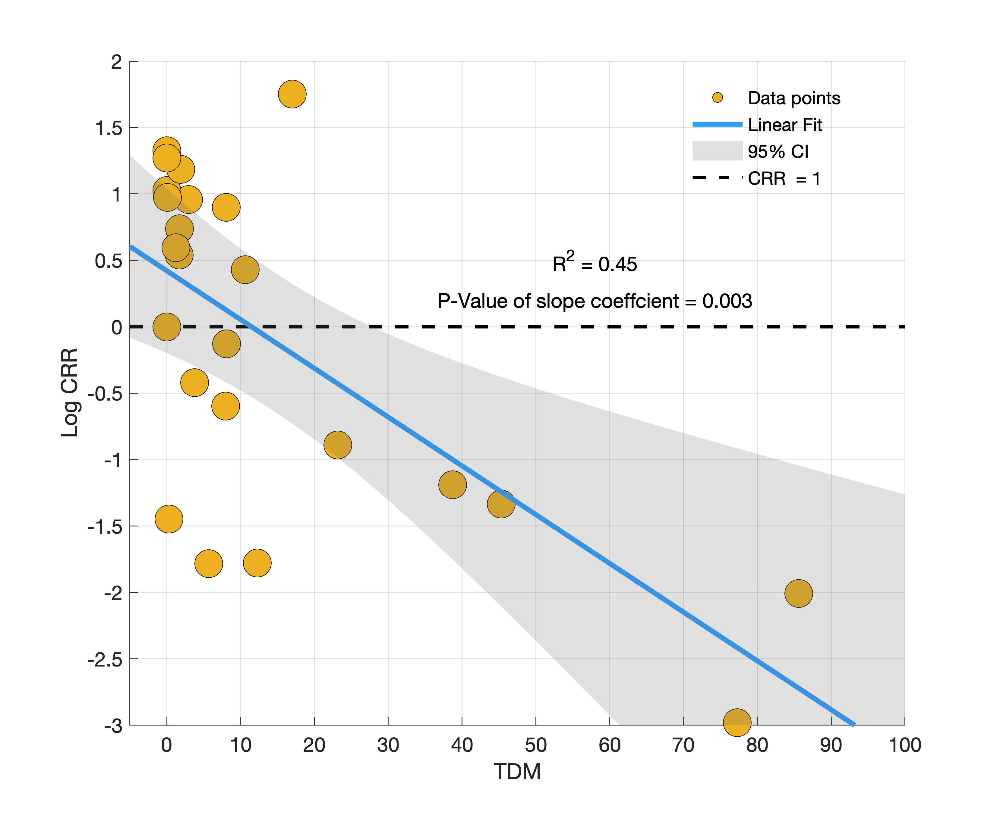

# Cohort Replacement and TDM 
Last updated 4/29/2024, Miles Daniels (miedanie@ucsc.edu)

**Script to explore relationship between Cohort Replacement Rate and TDM for Winter-Run

_Simulations last ran with R version 4.3.2 (2023-10-31) -- "Eye Holes"_

_Note 1: recent data provided by USFWS allows for adjustment of hatchery retunrs and age of returning fish goes from 2001 to 2022. We are estimating the relationship from 1996-2022 assuming minimal hatchery influence prior to 2001_

_Note 2: models have only undergone preliminary diagnostics to look for clear miss-specificaiton._

To start we can plot raw data. We have TDM and CRR from 1996-2022. Assume that the average age of returning adults is 3 years.
The eqaution to calculate the  CRR is:  $$\frac{E_i}{E_{i-3}}$$

Where _E_ is the total estimated run for year _i_.

We can also adjust for hatchery influence to better constrain for the actual number of the populaiton that experiecned TDM for a given year. 

The eqaution to calculate the adjusted CRR is:  $$\frac{E_i-H_i}{E_{i-3}}$$

Where _E_ is the total estimated run for year _i_, _H_ is the hatchery estimated run

## Below are time series for CCR and TDM. 

Another way to look at this data, however, is shown below where the time series of CRR is plotted, but each year is color coded by brood year TDM. Looking at the data this way seems to show that brood years with a significant amount of TDM often have a CRR of < 1. This relationship is even more apparent when looking at CRR on the log scale.

## Below is a time series of CRR color coded by TDM.

We can also explore if there is a linear relationship between CRR and TDM. We can add the model fit, 95% CI, and R2. 

## Below is a plot of the linear model with log CRR as the response and TDM as the predictor.

The fits result in a negative slope for the relationship (P < 0.05 for the log CRR fit) indicating that as TDM increases, CRR decreases. Note that since both quanities use carcass survey data, they are not independent and spurious relationships can occur. 

There are also years where TDM was low and CRR was < 1, indicating that other factors not included in this model are responsible for low adult returns. Other factors realted to this realtionship can be input into the model (such as ocean survival) to see if it improves the fit. 

# Add some conclusions, caveates, and disclaimers
